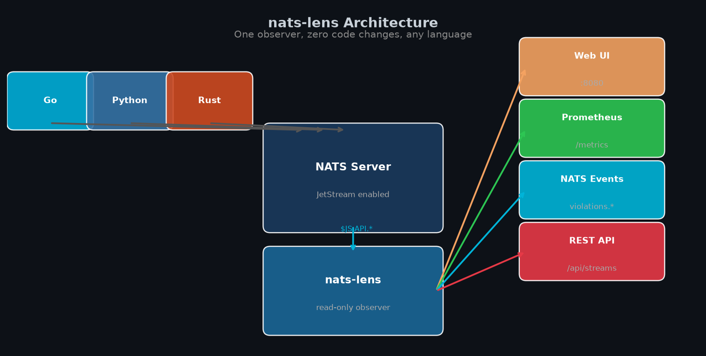
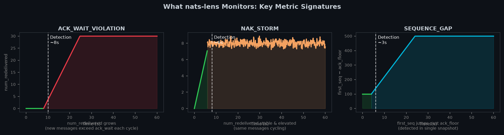
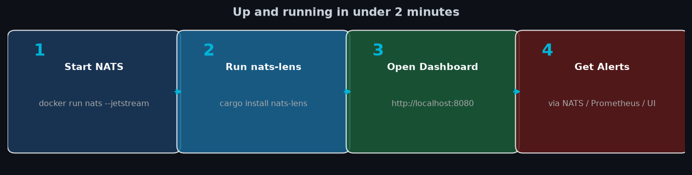

# nats-lens

**JetStream Health Monitor** — detects delivery guarantee violations in NATS JetStream in real time, across any language or framework.

[](LICENSE)
[](https://crates.io/crates/nats-lens)
[](https://arxiv.org/abs/2026.nats-lens)

---



---

## The Problem

NATS JetStream claims at-least-once delivery. But five common configuration mistakes silently violate this guarantee — producing duplicate messages, data loss, or redelivery storms — without any error in your application logs.

Standard monitoring tools (Prometheus Blackbox, Datadog, existing NATS dashboards) show throughput metrics. None of them detect *delivery correctness* failures.

**nats-lens detects all five.**



---

## Quick Start



---

## What It Detects

| Violation | What Happens | Visible To Existing Tools |
|---|---|---|
| **ACK_WAIT_VIOLATION** | `ack_wait` shorter than processing time → messages redelivered mid-processing → duplicate execution | ❌ No |
| **SEQUENCE_GAP** | Stream hit retention limit, evicted messages before consumer could pull them → silent data loss | ❌ No |
| **MAX_PENDING_THROTTLE** | `max_ack_pending` too small for concurrency + prefetch → consumer throttled despite having capacity | ❌ No |
| **NAK_STORM** | Consumer NAKing stale messages → NATS redelivers → still stale → infinite redelivery loop | ❌ No |
| **MISSING_PROGRESS** | Long-running tasks not sending in_progress acks → ack_wait fires → duplicate execution | ❌ No |

---

## Quick Start

**Requirements**: Docker, Rust (for building), or use the pre-built binary.

```bash
# 1. Start a local NATS server with JetStream
docker run -d --name nats -p 4222:4222 -p 8222:8222 nats:latest --jetstream

# 2. Install nats-lens
cargo install nats-lens

# 3. Run it
nats-lens --nats nats://localhost:4222 --port 8080

# 4. Open the dashboard
open http://localhost:8080
```

That's it. nats-lens connects to your NATS server, discovers all streams and consumers automatically, and starts monitoring.

---

## Works With Any Language

nats-lens doesn't touch your application code. It connects to NATS as an independent observer, reads stream and consumer state via the standard JetStream management API, and exposes findings through four channels:

### 1. Web Dashboard
```
http://localhost:8080
```
Dark-theme dashboard showing stream health, consumer metrics, and violation cards with fix commands.

### 2. Prometheus Metrics
```
http://localhost:8080/metrics
```
```
nats_lens_consumer_lag_msgs{stream="ORDERS",consumer="order-processor"} 142
nats_lens_ack_pending_ratio{stream="ORDERS",consumer="order-processor"} 1.0
nats_lens_violations_active{stream="ORDERS",consumer="order-processor",type="ACK_WAIT_VIOLATION"} 1
```

### 3. NATS Health Events
Subscribe to `nats.lens.health.violations.>` from **any language**:

```python
# Python
import nats
async def main():
    nc = await nats.connect("nats://localhost:4222")
    await nc.subscribe("nats.lens.health.violations.>", cb=handle_violation)
```

```go
// Go
nc, _ := nats.Connect("nats://localhost:4222")
nc.Subscribe("nats.lens.health.violations.>", func(msg *nats.Msg) {
    fmt.Println(string(msg.Data))
})
```

Each event is a JSON object:
```json
{
  "type": "ACK_WAIT_VIOLATION",
  "stream_name": "ORDERS",
  "consumer_name": "order-processor",
  "severity": "Critical",
  "description": "28 redeliveries/min — ack_wait (30s) shorter than processing time. Recommended: 117s",
  "detected_at": "2026-09-26T15:32:00Z",
  "violation": {
    "type": "ACK_WAIT_VIOLATION",
    "redeliveries_per_min": 28.4,
    "current_ack_wait_secs": 30,
    "recommended_ack_wait_secs": 117,
    "fix_command": "nats consumer edit ORDERS order-processor --ack-wait 1m57s"
  }
}
```

### 4. REST API
```bash
curl http://localhost:8080/api/streams
curl http://localhost:8080/api/history/ORDERS/order-processor
```

---

## Receive Violations in Any Language

nats-lens publishes to `nats.lens.health.violations.{stream}.{consumer}`. Subscribe from any NATS client — no code changes to your existing application.

<details>
<summary><b>Python</b></summary>

```python
import asyncio, json, nats

async def on_violation(msg):
    event = json.loads(msg.data)
    print(f"[{event['severity']}] {event['violation']['type']} on "
          f"{event['stream_name']}/{event['consumer_name']}")
    print(f"  Fix: {event['violation']['fix_command']}")

async def main():
    nc = await nats.connect("nats://localhost:4222")
    await nc.subscribe("nats.lens.health.violations.>", cb=on_violation)
    await asyncio.sleep(3600)

asyncio.run(main())
```
[Full example →](examples/python/subscribe.py)
</details>

<details>
<summary><b>Go</b></summary>

```go
nc, _ := nats.Connect("nats://localhost:4222")
nc.Subscribe("nats.lens.health.violations.>", func(msg *nats.Msg) {
    var event map[string]interface{}
    json.Unmarshal(msg.Data, &event)
    v := event["violation"].(map[string]interface{})
    fmt.Printf("[%s] %s on %s/%s\n  Fix: %s\n",
        event["severity"], v["type"],
        event["stream_name"], event["consumer_name"], v["fix_command"])
})
select {}
```
[Full example →](examples/go/main.go)
</details>

<details>
<summary><b>Rust</b></summary>

```rust
let nc = async_nats::connect("nats://localhost:4222").await?;
let mut sub = nc.subscribe("nats.lens.health.violations.>").await?;
while let Some(msg) = sub.next().await {
    let event: serde_json::Value = serde_json::from_slice(&msg.payload)?;
    println!("[{}] {} on {}/{}", event["severity"], event["violation"]["type"],
             event["stream_name"], event["consumer_name"]);
}
```
[Full example →](examples/rust/src/main.rs)
</details>

<details>
<summary><b>Node.js</b></summary>

```javascript
const { connect, StringCodec } = require("nats");
const nc = await connect({ servers: "nats://localhost:4222" });
const sub = nc.subscribe("nats.lens.health.violations.>");
for await (const msg of sub) {
    const event = JSON.parse(StringCodec().decode(msg.data));
    console.log(`[${event.severity}] ${event.violation.type} → ${event.violation.fix_command}`);
}
```
[Full example →](examples/nodejs/subscribe.js)
</details>

<details>
<summary><b>Java</b></summary>

```java
Dispatcher d = nc.createDispatcher(msg -> {
    JSONObject event = new JSONObject(new String(msg.getData()));
    System.out.printf("[%s] %s on %s/%s%n  Fix: %s%n",
        event.getString("severity"),
        event.getJSONObject("violation").getString("type"),
        event.getString("stream_name"), event.getString("consumer_name"),
        event.getJSONObject("violation").optString("fix_command"));
});
d.subscribe("nats.lens.health.violations.>");
```
[Full example →](examples/java/Subscribe.java)
</details>

---

## Deploy Anywhere

### Docker
```bash
docker run -p 8080:8080 ghcr.io/biplabku/nats-lens:latest \
  --nats nats://your-nats-server:4222
```

### Kubernetes Sidecar
```yaml
containers:
- name: nats-lens
  image: ghcr.io/biplabku/nats-lens:latest
  args: ["--nats", "$(NATS_URL)"]
  ports:
  - containerPort: 8080   # Web UI + REST API
  - containerPort: 9090   # Prometheus (if separate port configured)
```

### Docker Compose (local dev)
```bash
cd scripts/
docker-compose up -d
cargo run -p nats-lens -- --nats nats://localhost:4222
```

---

## CLI Reference

```
nats-lens [OPTIONS]

Options:
  --nats <URL>        NATS server URL [default: nats://localhost:4222]
  --port <PORT>       Web UI and API port [default: 8080]
  --interval <SECS>   Poll interval in seconds [default: 5]
  -h, --help          Print help
  -V, --version       Print version
```

---

## Understanding Fix Commands

Every violation card in the dashboard includes the exact NATS CLI command to fix it. For example:

```
ACK_WAIT_VIOLATION on ORDERS/order-processor:
  Measured P99 processing: ~47s
  Current ack_wait: 30s  ← too short
  Fix: nats consumer edit ORDERS order-processor --ack-wait 1m57s
```

See [docs/violations.md](docs/violations.md) for a detailed explanation of each violation type, why it happens, and how to fix it.

---

## Grafana Dashboard

Import [docs/grafana-dashboard.json](docs/grafana-dashboard.json) into your Grafana instance for pre-built panels showing consumer lag, redelivery rates, and violation history over time.

---

## Security

nats-lens connects to your NATS server using the same credentials you provide. It only reads from JetStream management API subjects (`$JS.API.*`) and publishes to `nats.lens.health.*`. It never reads message payloads.

For production deployments, run nats-lens inside your cluster so credentials never leave your network. See [docs/security.md](docs/security.md).

---

## Research

nats-lens is associated with the paper:

> **"Configuration-Induced Delivery Failures in NATS JetStream: Detection and Remediation"**  
> Biplab Das. Proceedings of [Venue], 2027.

The five violation types are formally characterized in the paper with proofs of their failure conditions and correctness of the detection algorithms.

---

## License

MIT — see [LICENSE](LICENSE).
